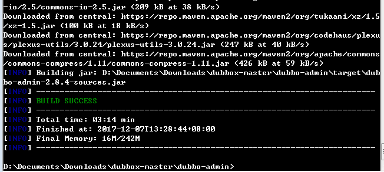
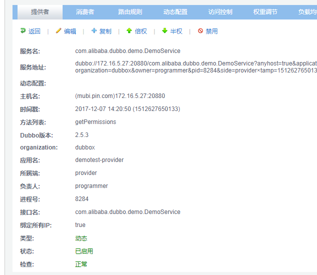
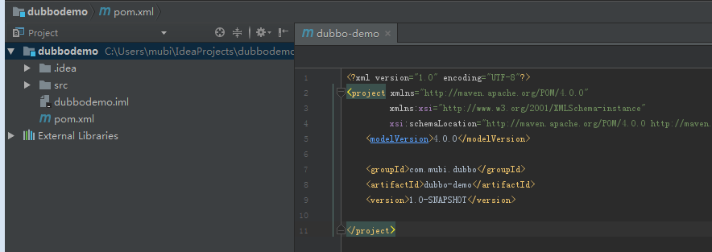
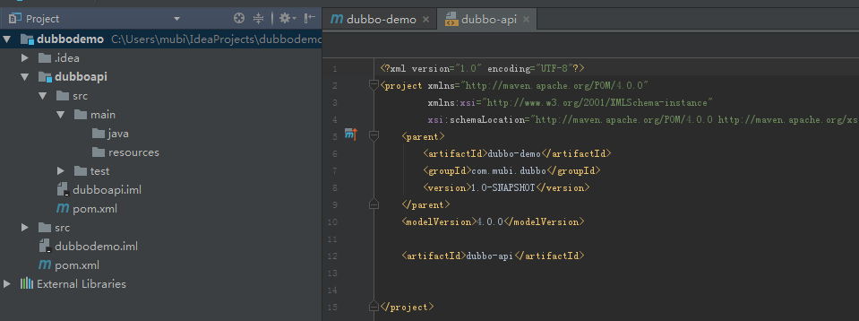
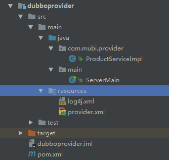
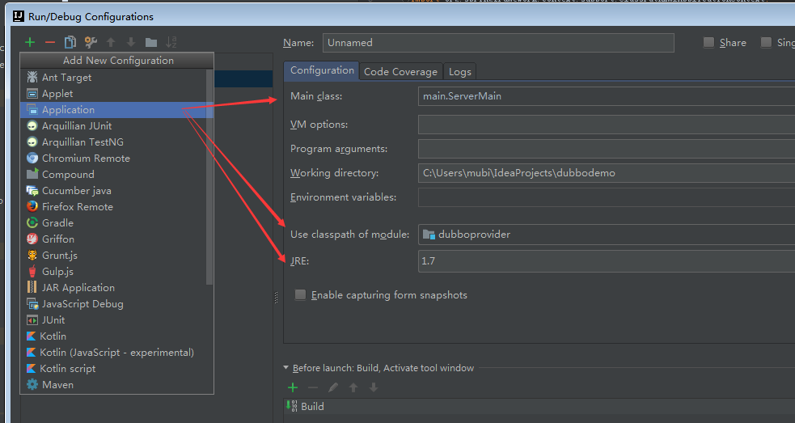
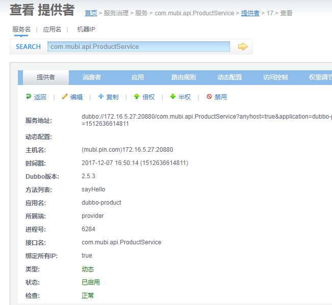
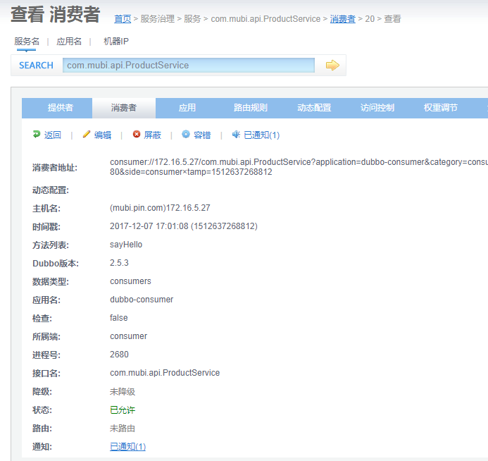

# dubbo使用

## dubbo基础使用

dubbo 项目搭建

* dubbo zookeeper spring 项目搭建

* dubbo 基本原理 和 项目的基本结构

* dubbo-admin 工具

### 环境准备

* jdk 1.8

* zookeeper-3.3.6

* apache-tomcat-8.5.24

* apache-maven-3.5.2

* intellij idea

* dubbo 

来自当当网：https://github.com/dangdangdotcom/dubbox

### 安装和demo运行

* zookeeper安装

http://blog.csdn.net/morning99/article/details/40426133

* Dubbo-admin管理平台的安装

https://www.cnblogs.com/xhkj/p/7407092.html




admin 首页查看 服务数，应用数等


admin 查看provider





源代码到github下载当当网的dubbox

* dubbo学习和demo主要参考

https://github.com/nomico271/DatatablesDemo


### 实践

* 构建maven project,然后新建module





* provider module目录



* 运行时，建立config



* 运行截图





## Dubbo SPI机制

```java
import com.alibaba.dubbo.common.extension.ExtensionLoader;
import com.mubi.provider.spi.Car;
import org.junit.Assert;
import org.junit.Test;

import java.util.ServiceLoader;
import java.util.concurrent.TimeUnit;

/**
 * @Author mubi
 * @Date 2020/9/1 18:33
 */
public class SPITest {

    @Test
    public void javaSpiTest() {
        ServiceLoader<Car> serviceLoader = ServiceLoader.load(Car.class);
        System.out.println("----java spi");
        boolean b = serviceLoader.iterator().hasNext();
        Assert.assertTrue(b);
        while(true) {
            for (Car car : serviceLoader) {
                car.drive();
            }
            try {
                TimeUnit.SECONDS.sleep(4);
            } catch (Exception e) {

            }
            System.out.println("----java spi end");
        }
    }

    @Test
    public void dubboSpiHello() {
        ExtensionLoader<Car> extensionLoader =
                ExtensionLoader.getExtensionLoader(Car.class);
        System.out.println("----dubbo spi");
        Car car1 = extensionLoader.getExtension("car1");
        car1.drive();
        Car car2 = extensionLoader.getExtension("car2");
        car2.drive();
    }
}
```
